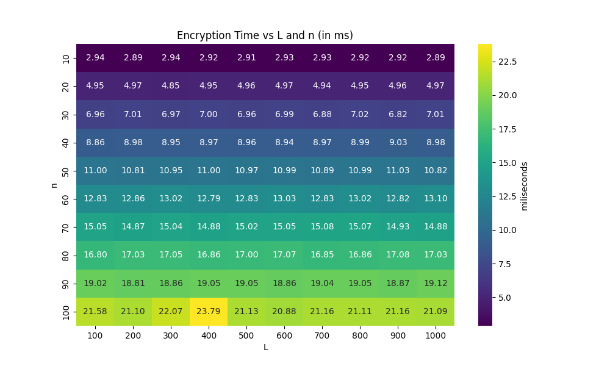
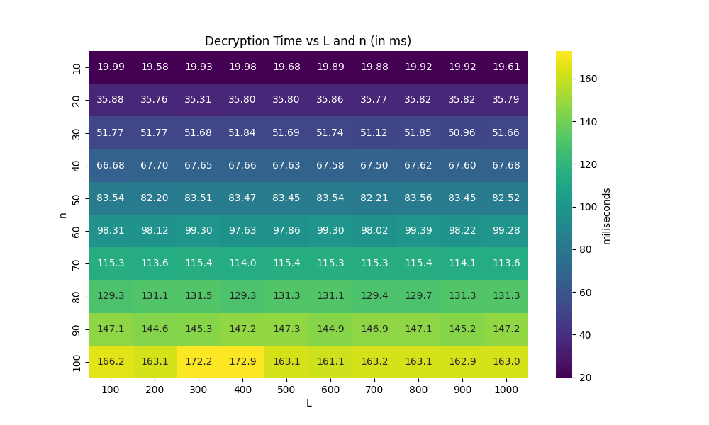
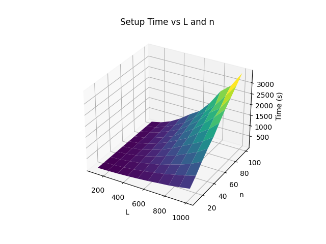
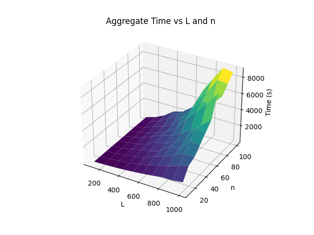
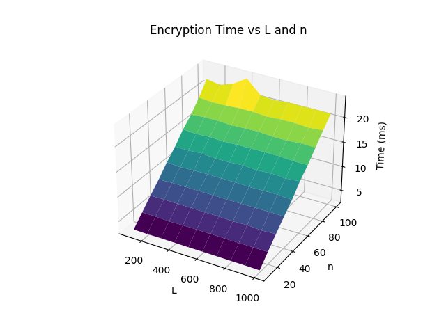
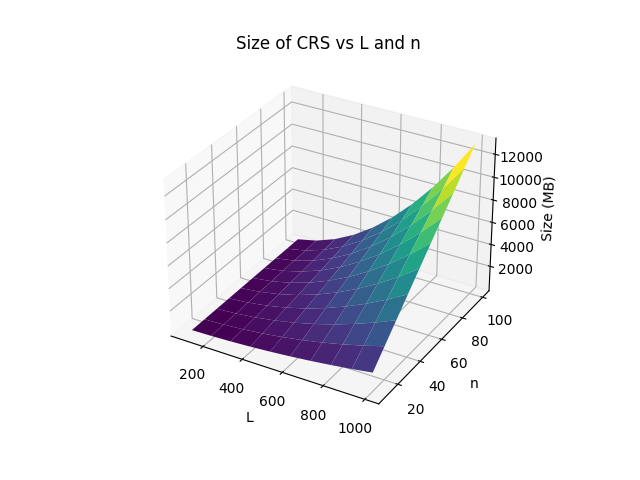

# Slotted Ripe

This is an implementation of the Slotted Registered Inner-Product Encryption from [https://eprint.iacr.org/2023/395.pdf](https://eprint.iacr.org/2023/395.pdf) using the BLS12-381 curve. The code uses the [Petrelic](https://github.com/spring-epfl/petrelic/) library. 

**Important Note:** This implementation is a draft and should not be used in any real-world applications. There is no security guarantee.

### Installation on Ubuntu

To install the Petrelic library on Ubuntu, run:
```
pip install petrelic
```

## Usage
First you need to give permission to run the run_benchmark.sh script:
```
chmod +x run_benchmark.sh
```
Then you can run the benchmark script:
```
./run_benchmark.sh
```
The script will run the benchmark for the different parameters and print the results.
The script has two modes, a full benchmark mode and a load mode, which loads the results from a file. The load mode is used to run the benchmark for different parameters without having to run the full benchmark again. To run the benchmark results from `benchmark.csv` file and generates the plots.
The benchmark mode can run with custom parameters or some default parameters, the default parameters take different values for the size of attribute vector as `n=[2,3,4,5,6]` and values for the number of slots as `L=[10,20,30,40,50]`.
Then it runs the benchmark for each parameter and saves the corresponding times in `benchmarks.csv`.

Here is an example of how to run the run_benchmark.sh script with custom parameters:
```
./run_benchmark.sh 
Choose a mode (1. Benchmark  2. Load From CSV) : 1
Do you want to run the benchmark with default parameters? n=[2,3,4,5,6] L=[10,20,30,40,50] (y/n) n
Enter the starting value for n: 2
Enter the step size for n: 1
Enter the number of steps for n: 10
Enter the starting value for L: 10
Enter the step size for L: 10
Enter the number of steps for L: 10
```
## Results
The results are saved in `benchmark.csv` file and the plots are saved in `plots` folder, we generate two different types for plot that compare each n,L with run-time of different algorithms and a plot that compares the run-time of different algorithms and size of some parameters. 
Here is the list of algorithm that we measure their performance:
- setup()
- aggregate()
- encrypt()
- decrypt()

We also measure the size of `crs` and `mpk` for different values of `n` and `L`.
We plotted our results in *heatmap* and *3D* plots. Here is the result of the benchmark for the following `n` and `L`:
- `n=[2,3,4,5,6,7,8,9,10,11]`
- `L=[10,20,30,40,50,60,70,80,90,100]`
### Heatmap plots 
#### Runtime of Setup and Aggregate


#### Runtime of Encrypt and Decrypt
 

#### Size of CRS and MPK


### 3D plots

#### Runtime of Setup and Aggregate


#### Runtime of Encrypt and Decrypt



#### Size of CRS and MPK



